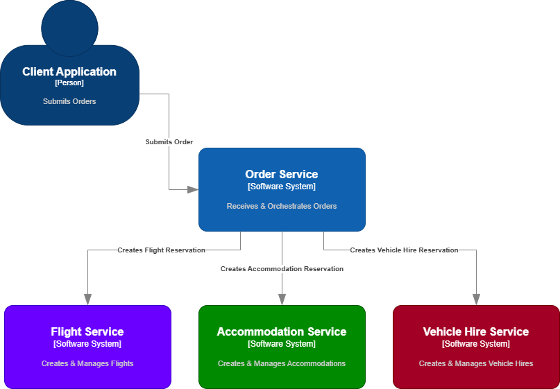
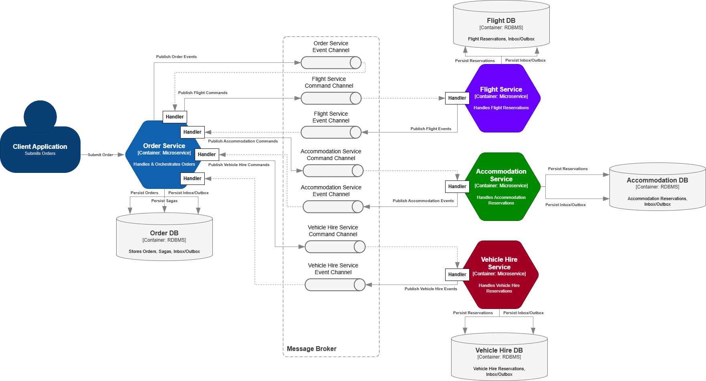

# dotnet-core-saga-example

> **Status:** Work in Progress 👷⚠🔧

Saga Pattern example (Orchestration) for the submission of `Travel Package` orders, comprising `Flights`, `Accommodation` & `Vehicle Hire`.

## Considerations / Notes
- [NX monorepo](https://nx.dev/) containing all required Microservices.
- In order to narrow down the scope/intent of this exercise, it **doesn't include**:
    - Authentication
    - Payment/billing
    - Notifications
- [AsyncAPI](https://www.asyncapi.com/en) & [Open API Specification](https://swagger.io/specification/) will be used where applicable.

## Task List

- [X] Top-level order processing event flow
- [X] System Context view diagram
- [X] Container View diagram
- [ ] Create template dotnet-core application (AsyncAPI, EF Migrations, OAS)
- [ ] Design Swagger/OAS (Order API)
- [ ] Design AsyncAPIs (TBD)
- [ ] Prepare Monorepo

## Solution Design

### System Context View

### Container View

### Order Processing Event Flow
Also visible [on Mermaid.ai](https://mermaid.ai/d/0a251da7-aab8-411d-a0b1-5e067c1ec91d)
